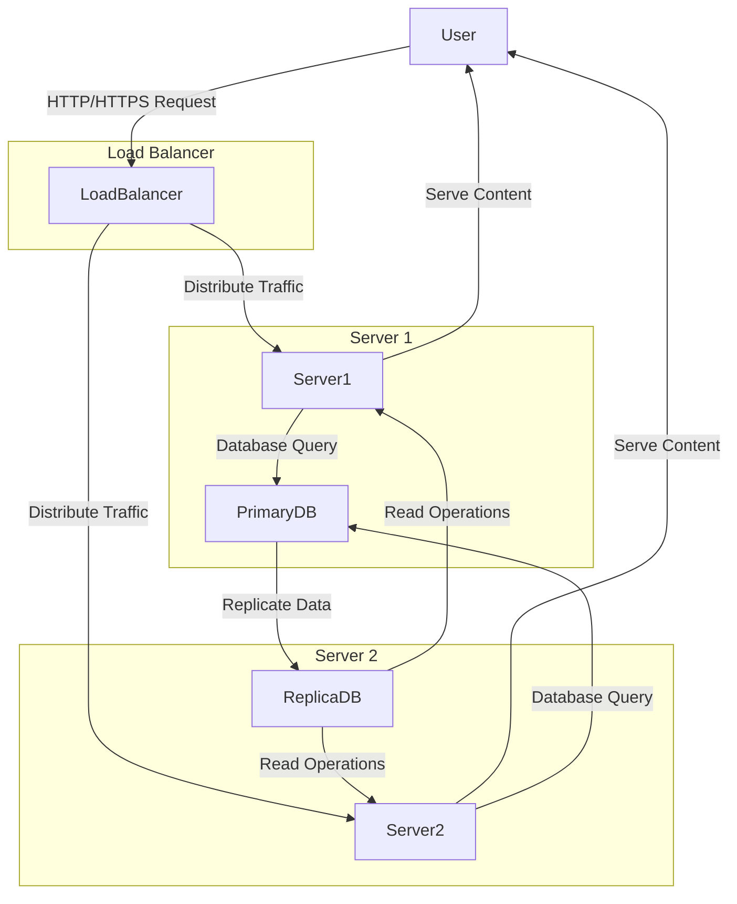

# Three Server Web Infrastructure

## 🎯 Objective: Design a web infrastructure with three servers to host the website [www.foobar.com](http://www.foobar.com).

---

## 📌 1️⃣ Description of the Scenario

A user wants to access the website **[www.foobar.com](http://www.foobar.com)** via their browser.

### Steps:

1. The user enters the URL **[www.foobar.com](http://www.foobar.com)** in their browser.
2. A DNS query is sent to resolve the domain name.
3. The DNS responds with the IP address of the load balancer.
4. The browser sends an HTTP/HTTPS request to the load balancer's IP.
5. The load balancer forwards the request to one of the available web servers.
6. The web server processes the request and may interact with the database.
7. The response (web page) is sent back through the load balancer to the user.

---

## 📌 2️⃣ Server Architecture

The infrastructure consists of:

* **1 Load Balancer (HAProxy)**: Distributes traffic between the two servers.
* **2 Application Servers** (identical configuration):

  * **Web Server (Nginx)**: Handles HTTP requests and serves static content.
  * **Application Server**: Executes backend logic.
  * **Application Files**: Codebase of the application.
  * **Database (MySQL)**: Stores application data.

---

## 📌 3️⃣ Explanation of Components

| Component                      | Role                                                                                         |
| ------------------------------ | -------------------------------------------------------------------------------------------- |
| **Load Balancer (HAProxy)**    | Distributes incoming traffic across the two servers to ensure availability and scalability.  |
| **Web Server (Nginx)**         | Manages HTTP requests and serves static files.                                               |
| **Application Server**         | Executes backend code, processes data, and generates responses.                              |
| **Database (Primary-Replica)** | Uses master-slave replication to synchronize data between the primary and replica databases. |

### Load Balancer Algorithm: Round Robin

* **Round Robin**: Distributes incoming requests evenly across both servers.
* Ensures balanced usage and avoids overloading a single server.

### Active-Active vs. Active-Passive Setup:

* **Active-Active**: Both servers are active and handle requests simultaneously.
* **Active-Passive**: One server is active, while the other remains on standby.
* Our setup uses **Active-Active** for increased availability and load distribution.

### Database Primary-Replica (Master-Slave) Setup:

* **Primary Node (Master)**: Handles write and read operations.
* **Replica Node (Slave)**: Synchronizes data from the master and primarily handles read operations.

---

## 📌 4️⃣ Issues Identified

1. **Single Point of Failure (SPOF)**:

   * Load Balancer: If it fails, the entire infrastructure becomes inaccessible.

2. **Security Issues**:

   * No firewall to protect servers.
   * No HTTPS for secure communication.

3. **No Monitoring**:

   * Lack of monitoring tools to detect performance issues or downtime.

---

## 📌 5️⃣ Infrastructure Diagram

