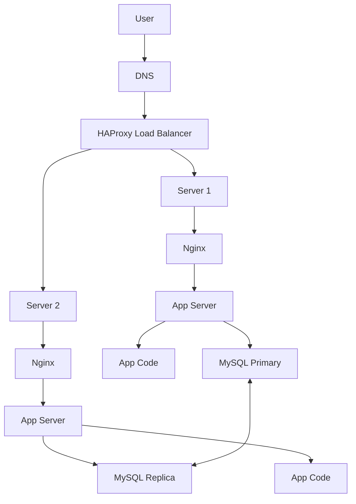

# Distributed Web Infrastructure

## Infrastructure Design
The web infrastructure consists of three servers and a load balancer to distribute traffic. Below is the design:

1. **Load Balancer**: HAProxy to distribute traffic between two servers.
2. **Two Servers**:
   - **Web Server (Nginx)**: Handles HTTP requests and serves static files.
   - **Application Server**: Processes dynamic requests and runs the application code.
   - **Application Files**: The codebase for the website.
   - **Database**: MySQL configured in a Primary-Replica (Master-Slave) setup.

---

## Explanation of Components

### Load Balancer
- **Why Add It**: To distribute incoming traffic across multiple servers, improving availability and scalability.
- **Distribution Algorithm**: Configured with a **Round Robin** algorithm, which sends each incoming request to the next server in line, ensuring an even distribution of traffic.
- **Active-Active vs. Active-Passive**:
  - **Active-Active**: Both servers handle traffic simultaneously, increasing capacity.
  - **Active-Passive**: One server is active, while the other is on standby, ready to take over if the active server fails.
  - **Setup Used**: Active-Active for better resource utilization.

### Database (Primary-Replica Cluster)
- **How It Works**: The Primary node handles all write operations, while the Replica node synchronizes data from the Primary and handles read operations.
- **Difference Between Primary and Replica**:
  - **Primary Node**: Handles write operations and propagates changes to the Replica.
  - **Replica Node**: Handles read operations to reduce the load on the Primary.

---

## Issues with This Infrastructure

1. **Single Point of Failure (SPOF)**:
   - The load balancer is a SPOF. If it fails, the entire infrastructure becomes inaccessible.
2. **Security Issues**:
   - No firewall to filter malicious traffic.
   - No HTTPS, leaving data vulnerable to interception.
3. **No Monitoring**:
   - Lack of monitoring tools to detect and respond to issues in real-time.

---

## Diagram of the Infrastructure

