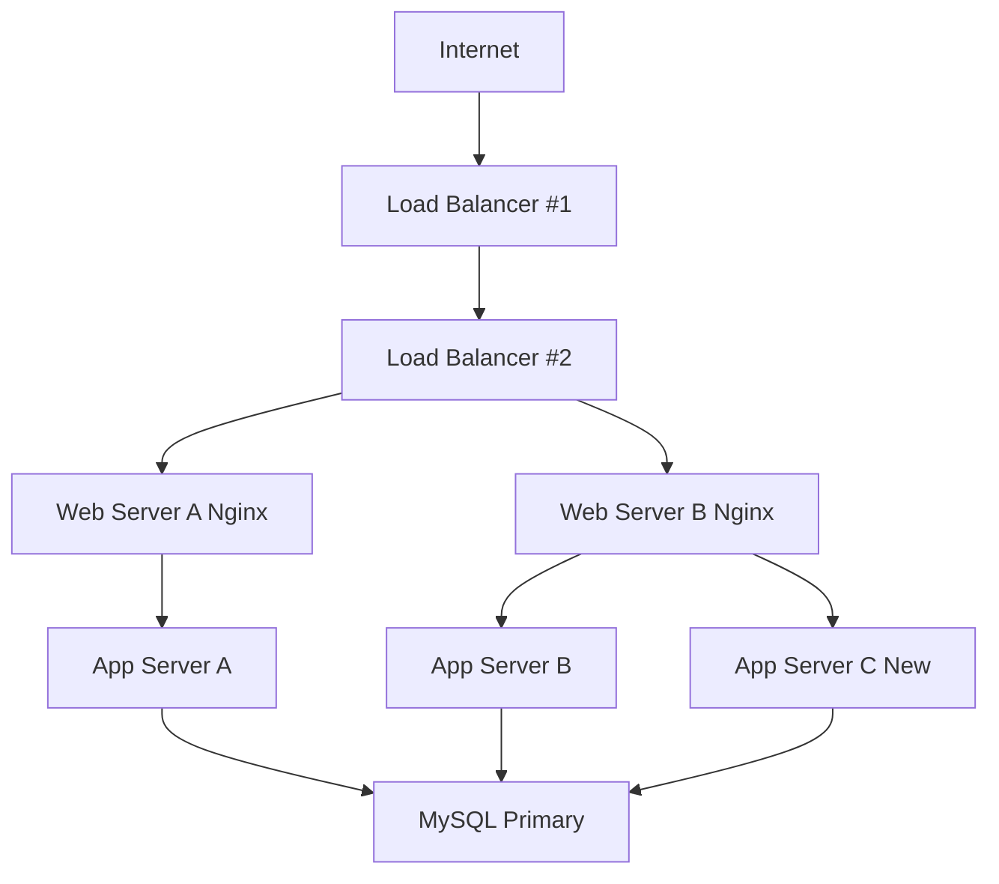

# 3. Scale Up

This document outlines a scalable infrastructure by separating components and adding redundancy.

---

## ⚙️ Diagram

---

## 💡 Explanation

### Why Add These Components?

- **Second Load Balancer**: Removes single point of failure.
- **New App Server**: Scales dynamic processing capacity.
- **Split Roles**: Web, App, DB on separate machines increases manageability.

---

## 📘 Application Server vs Web Server

| Web Server (Nginx)        | Application Server          |
|---------------------------|-----------------------------|
| Handles static files, HTTP| Runs backend logic (e.g. API)|
| Reverse proxy             | Processes dynamic content    |

---

This architecture improves scalability and fault tolerance while clearly separating system concerns.
